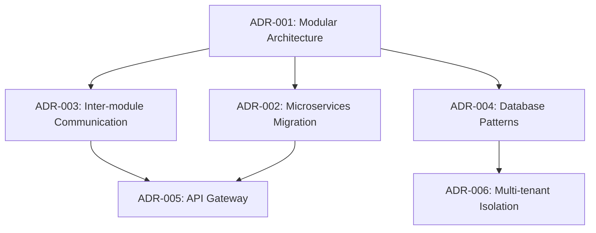

# Architecture Decision Records (ADR) Index

This document maintains an index of all Architecture Decision Records for the DemoHotel19May
project.

## ADR Status Legend

- 🟢 **Accepted** - Decision has been implemented and is active
- 🟡 **Proposed** - Decision is under review and discussion
- 🔴 **Deprecated** - Decision is no longer active but remains for reference
- 🔄 **Superseded** - Decision has been replaced by a newer ADR

## Current ADRs

| ADR                                                       | Title                               | Status      | Date       | Tags                               | Impact |
| --------------------------------------------------------- | ----------------------------------- | ----------- | ---------- | ---------------------------------- | ------ |
| [ADR-001](adr-001-modular-architecture-implementation.md) | Modular Architecture Implementation | 🟢 Accepted | 2025-01-24 | architecture, modules, scalability | High   |

## Proposed ADRs (Future Decisions)

| ADR     | Title                                | Status      | Expected Date | Priority | Owner               |
| ------- | ------------------------------------ | ----------- | ------------- | -------- | ------------------- |
| ADR-002 | Microservices Migration Strategy     | 🟡 Proposed | Q2 2025       | Medium   | Architecture Team   |
| ADR-003 | Inter-module Communication Patterns  | 🟡 Proposed | Q1 2025       | High     | Architecture Team   |
| ADR-004 | Module-specific Database Patterns    | 🟡 Proposed | Q1 2025       | Medium   | Database Team       |
| ADR-005 | API Gateway Implementation           | 🟡 Proposed | Q2 2025       | High     | Infrastructure Team |
| ADR-006 | Multi-tenant Data Isolation Strategy | 🟡 Proposed | Q1 2025       | High     | Security Team       |

## ADR Categories

### 🏗️ Architecture & Design

- [ADR-001: Modular Architecture Implementation](adr-001-modular-architecture-implementation.md)

### 🔒 Security & Compliance

- _No current ADRs - proposed ADR-006_

### 🚀 Performance & Scalability

- _Related to ADR-001 modular architecture_

### 🏢 Multi-tenant & SaaS

- _Related to ADR-001, proposed ADR-006_

### 🔧 Infrastructure & DevOps

- _Proposed ADR-005 for API Gateway_

### 📊 Data & Analytics

- _Proposed ADR-004 for database patterns_

## Decision Timeline

```mermaid
timeline
    title Architecture Decision Timeline

    2025-01-24 : ADR-001 Modular Architecture
                : Status: Implemented ✅
                : Impact: Foundation for scalability

    Q1 2025    : ADR-003 Inter-module Communication
               : ADR-004 Database Patterns
               : ADR-006 Multi-tenant Isolation

    Q2 2025    : ADR-002 Microservices Migration
               : ADR-005 API Gateway Implementation
```

## ADR Dependencies

## Impact Assessment

### High Impact ADRs

- **ADR-001:** Modular Architecture - Foundation for all future architectural decisions
- **ADR-003:** Inter-module Communication - Critical for system performance and reliability
- **ADR-005:** API Gateway - Essential for microservices architecture
- **ADR-006:** Multi-tenant Data Isolation - Critical for SaaS platform security

### Medium Impact ADRs

- **ADR-002:** Microservices Migration - Long-term scalability improvement
- **ADR-004:** Database Patterns - Performance and maintainability improvements

## Governance Process

### ADR Creation Process

1. **Identify Need** - Architecture decision required
2. **Use Template** - Use [ADR Template](adr-template.md)
3. **Research & Analysis** - Gather requirements and options
4. **Stakeholder Review** - Technical team review and feedback
5. **Approval Process** - Multi-role approval (see template)
6. **Implementation** - Execute the decision
7. **Update Index** - Add to this index
8. **Monitor & Review** - Track implementation success

### Review Schedule

- **Monthly ADR Review** - First Friday of each month
- **Quarterly Impact Assessment** - Evaluate ADR effectiveness
- **Annual Architecture Review** - Comprehensive governance review

### Approval Requirements

| ADR Impact | Required Approvers                                        | Timeline |
| ---------- | --------------------------------------------------------- | -------- |
| **High**   | Architect, Security Lead, Product Owner, Engineering Lead | 2 weeks  |
| **Medium** | Architect, Engineering Lead                               | 1 week   |
| **Low**    | Architect                                                 | 3 days   |

## ADR Quality Checklist

Before approving any ADR, ensure:

- [ ] **Clear Problem Statement** - Well-defined challenge or requirement
- [ ] **Multiple Options Considered** - At least 3 viable alternatives evaluated
- [ ] **Decision Rationale** - Clear justification for chosen option
- [ ] **Implementation Plan** - Concrete steps and success criteria
- [ ] **Risk Assessment** - Identified risks and mitigation strategies
- [ ] **Compliance Alignment** - Aligns with governance framework
- [ ] **Testing Strategy** - Comprehensive validation approach
- [ ] **Documentation** - All necessary documentation requirements
- [ ] **Stakeholder Approval** - Required approvals obtained
- [ ] **Future Considerations** - Migration path and evolution strategy

## Related Documents

### Governance Framework

- [Governance Validator](../../tools/governance/governance-validator.js)
- [Governance Rules Configuration](../../package.json#governance)
- [SSOT Registry](../../config/ssot-registry.json)

### Architecture Documentation

- [Architecture Overview](ARCHITECTURE.md)
- [Architecture Guidelines](ARCHITECTURE_GUIDELINES.md)
- [System Design Patterns](SYSTEM_DESIGN_PATTERNS.md)

### Process Documentation

- [Development Workflow](../development/DEVELOPMENT_WORKFLOW.md)
- [Code Review Guidelines](../development/CODE_REVIEW_GUIDE.md)
- [Deployment Procedures](../deployment/DEPLOYMENT_GUIDE.md)

## Statistics

### Current Status

- **Total ADRs:** 1
- **Accepted:** 1 (100%)
- **Proposed:** 5
- **Deprecated:** 0
- **Superseded:** 0

### Coverage Areas

- ✅ **Architecture Patterns** - Covered by ADR-001
- 🟡 **Security Frameworks** - Pending ADR-006
- 🟡 **Performance Strategies** - Pending ADR-004
- 🟡 **Infrastructure Design** - Pending ADR-005
- 🟡 **Migration Strategies** - Pending ADR-002

---

## Contributing to ADRs

### When to Create an ADR

Create an ADR when making decisions about:

- System architecture and design patterns
- Technology selection and integration
- Security and compliance approaches
- Performance and scalability strategies
- Database design and data management
- Infrastructure and deployment patterns
- API design and communication protocols

### ADR Best Practices

1. **Be Specific** - Focus on concrete decisions, not general guidelines
2. **Consider Alternatives** - Always evaluate multiple options
3. **Document Trade-offs** - Clearly explain what's gained and lost
4. **Include Context** - Explain why the decision is needed
5. **Plan Implementation** - Provide actionable steps
6. **Monitor Outcomes** - Track if the decision achieved goals
7. **Update When Needed** - Revise or supersede when circumstances change

---

**Last Updated:** 2025-01-24  
**Next Review:** 2025-02-24  
**Maintained by:** Architecture Team
